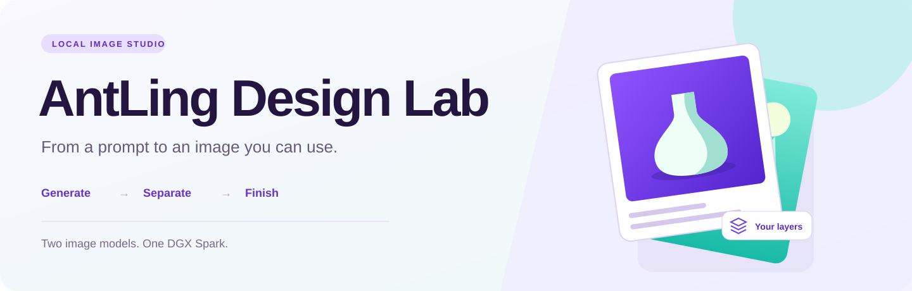

# AntLing Design Lab

A local image studio for NVIDIA DGX Spark / GX10. Generate a design, separate it into transparent layers, and finish a graphic with editable text—all in your browser.

- **Generate:** turn a prompt into a 1024 or 2048 px square image.
- **Separate:** describe the elements you want as individual transparent PNGs.
- **Finish:** arrange layers, clean edges, add text, and export a social graphic.

[Installation](docs/setup.md) · [User guide](docs/usage.md) · [Prompt providers](docs/providers.md) · [Performance](docs/performance.md) · [Security](SECURITY.md)

## Get started

The image models run on your Spark; the browser can run on the Spark or another computer. Setup requires NVIDIA Docker GPU support, Git, Python 3 with `venv`, and space for both model checkpoints and the container image.

**[Follow the installation guide →](docs/setup.md)**

The app is for one trusted user. It listens on the Spark's loopback interface. When connecting from another computer, the guide shows how to use an SSH tunnel.

## Bring your own prompt model

Prompt expansion is optional. Use your words directly, or choose OpenAI, Claude, Z.ai, DeepSeek, a local OpenAI-compatible endpoint, or the optional Codex CLI helper. Provider keys stay on the Spark and are excluded from Git. Only a selected external provider receives your prompt.

See [provider setup](docs/providers.md) and [.env.example](.env.example).

## Models and limits

| Model | Purpose | Output |
| --- | --- | --- |
| [Ming-Image-0.1-Design](https://huggingface.co/inclusionAI/Ming-Image-0.1-Design) | Image generation | 1024 or 2048 px square |
| [Ming-Image-0.1-Design-Layer](https://huggingface.co/inclusionAI/Ming-Image-0.1-Design-Layer) | Layer decomposition | Up to 1024 px working size |

Layers contain raster pixels; generated lettering is not editable text. The Finish editor adds editable text separately. Source-size cutouts reuse the original image under resized model masks and can need edge cleanup. Initial model loading takes several minutes; see [measured timings](docs/performance.md).

Images, prompts, and saved projects live in `jobs/` on your Spark. Back up that folder separately. Model weights, local settings, and generated work are not part of this repository.

## Development

```bash
python3 -m venv .venv
.venv/bin/pip install -r requirements-web.txt
.venv/bin/python -m unittest discover -s tests
```

The interface uses plain HTML, CSS, and JavaScript; the server uses FastAPI. There is no frontend build step. See [agent integrations](docs/agent-skills.md) for the local image API.

## License

[MIT](LICENSE) for the app. The bundled prompt template is from inclusionAI and retains its [MIT notice](resources/LICENSE). Model weights and [upstream inference code](https://github.com/inclusionAI/Ming-Image) are downloaded separately under their own licenses. AntLing Design Lab is an independent project, not an official inclusionAI product.
